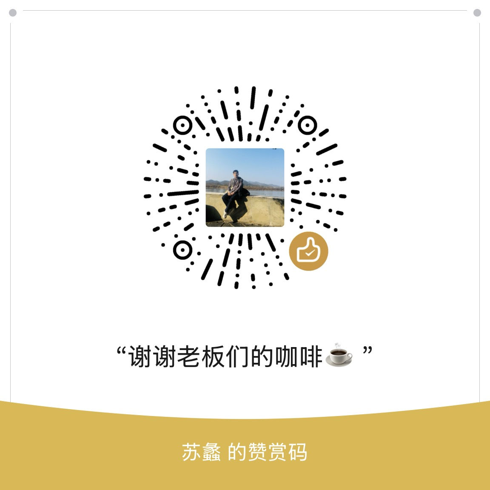

# url-digest

基于 URL 链接读取文章并按结构化方法论进行提炼总结的 AI Agent Skill。

如果感觉有用，欢迎 ⭐️ [Star](https://github.com/zhimeng118/url-digest) 支持！

## 功能特性

- 📖 支持读取公众号文章、网页文章链接
- 🔍 结构化提炼：9 大维度分析
- 📝 支持两种输出格式：
  - **Markdown**（默认）：便于阅读的纯文本
  - **JSON**：用于对接工作流
- 🔄 key 自动翻译：中英文自适应
- 💾 用户自定义输出路径

## 支持的 Agent

- Claude Code
- Cursor
- OpenCode
- 以及其他支持 skills 的 AI 工具

## 安装

```bash
npx skills add zhimeng118/url-digest
```

## 使用方法

### 基本用法

```
帮我提炼这篇公众号文章 https://mp.weixin.qq.com/s/xxx
```

### 指定输出格式

```
帮我提炼并输出json格式 https://mp.weixin.qq.com/s/xxx
```

### 指定保存路径

```
帮我提炼文章保存到 ~/docs/summary.md
```

## 提炼维度

1. **元信息** - 标题、链接、作者、来源、日期
2. **是否软广** - 判断广告/软文
3. **作者身份** - 职业、行业、影响力
4. **主题与实体** - 核心主题、关键实体
5. **读者群体** - 目标受众画像
6. **文章价值** - 定性+定量分析
7. **核心观点与金句** - 精华内容
8. **关键速览** - 快速概览要点
9. **内容标签** - 归类标签

## 输出示例

### Markdown 格式

```markdown
# 文章标题

> 原文链接：xxx

## 一、元信息
- **标题**: xxx
- **作者**: xxx

## 二、是否软广
- **是否软广**: false

...
```

### JSON 格式

```json
{
  "meta": { "title": "xxx", "author": "xxx" },
  "is_ad": false,
  "author_profile": { "job": "xxx" },
  ...
}
```

## 依赖

- [agent-browser](https://github.com/vercel-labs/agent-browser) - 用于读取网页内容

## 打赏支持

如果你觉得这个工具对你有帮助，欢迎打赏一杯咖啡 ☕️



## License

MIT License - see [LICENSE](./LICENSE) file.

## Author

zhimeng

---

## Author

zhimeng
